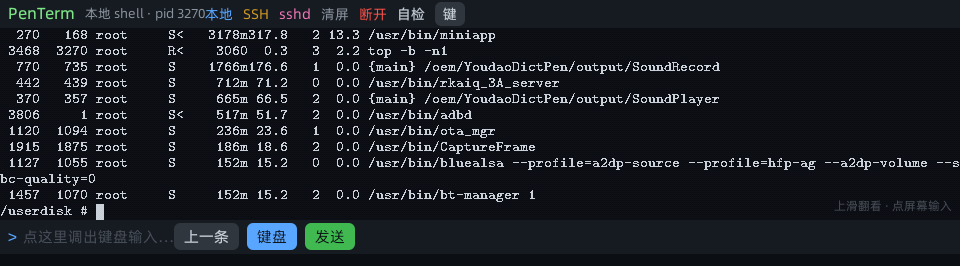

# PenTerm —— 有道词典笔终端 miniapp

在**有道词典笔 YDPX7-1（X7 Pro）/ YDPX6-2（X6 Pro）** 上跑的**真终端**：
本地 PTY shell + SSH 客户端 + 一键在笔上起 sshd，界面按 960×266 适配，**完全自研入口（不依赖官方 aiot-vue-cli）**。



## 特性

| 能力 | 说明 |
|---|---|
| **真 PTY** | `forkpty()` 起的真 shell，不是命令解析器 → `top` / `vi` / `less` 等全屏程序可用 |
| **自绘 VT 渲染** | 插件里做 VT/ANSI 仿真 + 8×16 点阵渲染成 PNG，页面用 `<image>` 显示。框架只有比例字体（实测 `i`×61=241px vs `M`×61=790px），文本行永远对不齐，这条路绕开了它 |
| **中文支持** | 16×16 CJK 点阵（GB2312 全字集 6938 字形），**双宽字符**占两列，中文文件名/输出正确且列对齐 |
| **系统键盘输入** | 通过 `global` 模块 `startTextEdit` 拉起笔的系统输入法，「执行」回调取回文本 |
| **命令历史回填** | 输入行显示「上一条：xxx」，点一下把命令灌进原生键盘，改完直接执行 |
| **滚动回看** | VT 侧 600 行环形历史，触摸上下滑动翻页 + 「上翻/下翻/回到最新」 |
| **SSH** | `/bin/ssh` 客户端（密码/密钥/自动填密码）；一键在笔上起 OpenSSH sshd，可从电脑 ssh 进笔 |
| **VT 支持范围** | C0、`CSI A B C D E F G H f J K L M P @ S T X d m h l r s u`、SGR（含 256 色）、DEC 存光标、`?25` 光标、`?7` 自动换行、`?47/?1047/?1049` 备用屏、OSC 忽略、UTF-8、宽字符 |


## 安装

1. 笔需要 root（本项目配套的固件补丁见 `docs/`；或你自己的 root 方案）。
2. 把 `dist/PenTerm-9.2.0.amr` 传到笔上安装：

```sh
adb push dist/PenTerm-9.2.0.amr /tmp/penterm.amr
adb shell "miniapp_cli install /tmp/penterm.amr"
adb shell "miniapp_cli start 8001999000000001 index"     # 注意：页面名不带 --
```

> ⚠ 换包必看：`miniapp_cli uninstall <appid>` → 等日志出现 `appDestroyed` → `install` → `start <appid> index`，
> 并用 `grep appResumed` 的 `getVersion()` 确认新版本真的在跑（旧实例会一直活着误导你）。
> 如果应用在重启后从桌面消失（日志里 `pm name=终端 type=removed`），**重新 install 一次**即可恢复注册表条目。

## 构建

工具有三个，都在 `tools/`（都不依赖官方私有 CLI）：

| 工具 | 作用 |
|---|---|
| `jsfmc.c` | 在**笔上**把 JS 编成框架认的 `.js.bin`（链接笔自己的 `libquickjs.so`；`.js.bin` 的容器头就是 QuickJS 字节码的一部分，必须整文件喂 `JS_ReadObject`） |
| `pack_amr.py` | 打包 `.amr`：`manifest.json` + `cert`（除 manifest/icon 外全部文件）+ 多 ABI 放插件 |
| `mkfont.py` / `mkcjk.py` / `mkicon.py` | ASCII 点阵 / CJK 点阵（从 TTF 光栅化）/ 应用图标 |

```powershell
$root = "<本仓库父目录>"; $adb = "adb"; $s = "<笔序列号或 IP:5555>"
$qj = "<quickjs 头文件目录>"     # 需要笔上 /usr/lib/libquickjs.so 对应的 quickjs.h

# 1) 插件（zig 交叉编译，链接笔上的 libquickjs.so / libz.so.1）
& zig cc -target aarch64-linux-gnu.2.29 -O2 -fPIC -shared -fvisibility=hidden -I $qj `
  src/term.c <libquickjs.so> <libz.so.1> -o libjsapi_term.so -lpthread -lutil
#   ⚠ custom_init_jsapis / custom_init_jsmodules 必须 __attribute__((visibility("default")))

# 2) 字库（从笔自带字体生成；中文用 mkcjk.py）
adb pull /etc/miniapp/resources/fonts/HarmonyOS_Sans_SC_Regular.ttf .
python tools/mkcjk.py HarmonyOS_Sans_SC_Regular.ttf src/font_cjk.h 16
adb pull /etc/miniapp/resources/latex/res/fonts/latin/optional/cmtt10.ttf .
python tools/mkfont.py cmtt10.ttf src/font8x16.h 15

# 3) 页面（在笔上编译）
adb push src/{app,base-page,component,page-index}.js /tmp/
adb shell "cd /tmp && for f in app base-page component page-index; do /tmp/jsfmc -o /tmp/\$f.js.bin -n \$f.js /tmp/\$f.js; done"
# 4) 打包
python tools/pack_amr.py --src build --out PenTerm.amr --appid 8001999000000001 --name "终端" --version 9.2.0 `
  --lib arm64=libjsapi_term.so --lib arm64-orange=libjsapi_term.so
```

## 自研入口契约（逆向出来的，缺一不可）

`app.js` 是应用入口，框架对它有一串隐式要求（官方 aiot-vue-cli 会注入这些胶水，用官方工具时看不到）：

```js
import './index.js';                 // ① 必须 import 页面模块，框架才会去求值/注册页面
import './shell.js';
import { BasePage } from './BasePage.js';

App.meta = {                         // ② 应用配置
  name: '终端', version: '9.2.0', isSingleJsBundle: false,
  pages: { index: 'pages/index/index.vue', shell: 'pages/index/shell.vue' },  // 值是 .vue 源码路径
  options: { style: { lessPaths: ['styles'] } },
};
$falcon.__AppClazz = App;            // ③ 框架从这里取 App 类
$falcon.__loadModuleDefault = fn;    // ④ loadPage 里会调用它
$falcon.__KEYFRAMES = {...};         // ⑤ 关键帧表
// onLaunch: this.setViewPort(960); $falcon.useDefaultBasePageClass(BasePage)
```

**页面挂载的关键**：框架实例化的是**基类页面**（`useDefaultBasePageClass` 传进去的那个类），
页面模块 default 导出的类不会被实例化 —— 所以挂载必须写在基类的 `onLoad` 里：

```js
// base-page.js
import Component from './Component.js';
export class BasePage extends $falcon.Page {
  onLoad(options) {
    super.onLoad(options);
    this.setRootComponentOptions(Component);   // ★ 普通 Vue options 对象用这个；
  }                                            //   setRootComponent 是留给 Vue 组件类的
}
```

更多细节（官方胶水的完整行为、`$falcon` 只被写 3 个键、`__pages` 官方也不用、追踪方法）见 [docs/entry-contract.md](docs/entry-contract.md)。

## 目录

```
src/      应用与插件源码（app.js / base-page.js / component.js / page-index.js / term.c / term_vt.c / 字库 / zlib_min.h）
tools/    构建工具（jsfmc.c / pack_amr.py / mkfont.py / mkcjk.py / mkicon.py / gh_push.py）
dist/     打包好的 .amr
docs/     截图与契约文档
```

## 许可

代码 MIT（见 LICENSE）。字体见 [THIRD_PARTY.md](THIRD_PARTY.md)：
`font8x16.h` 派生自笔上的 `cmtt10.ttf`（GUST Font License），`font_cjk.h` 派生自 HarmonyOS Sans SC（OFL）。
