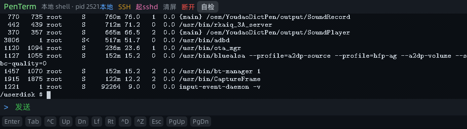
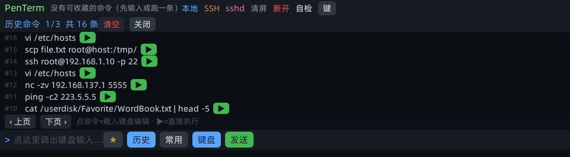
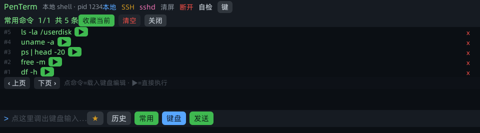
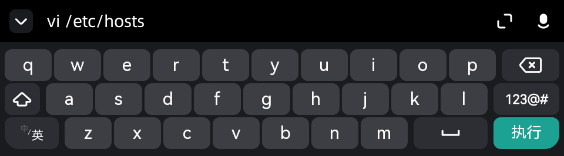
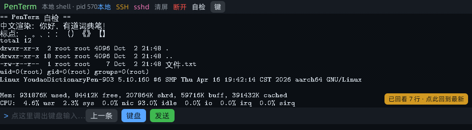
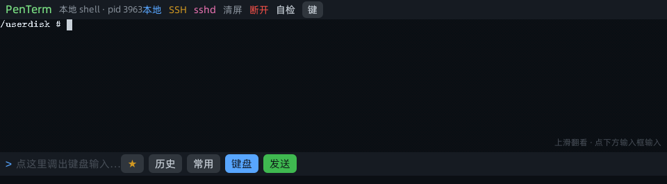
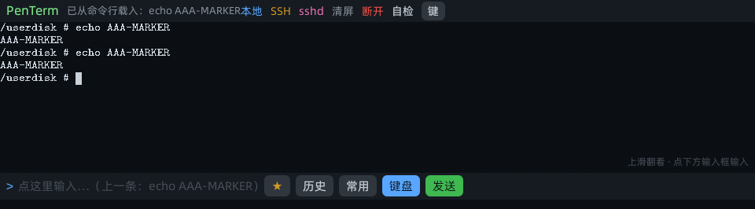

# PenTerm —— 有道词典笔上的真终端（含完整构建工具链与全部历史版本）

在**有道词典笔**（YDPX6/X7 系列，RK3562，PenOS 4.x）上跑一个**真正的 VT 终端**：
本地 PTY shell + SSH 客户端 + 一键在笔上起 sshd，支持中文渲染、滚动回看、
命令历史（可查看/编辑全部历史）与常用命令收藏。

本仓库同时保存**制作过程**（交叉编译工具链、amr 打包器、点阵字体生成器、
QuickJS 字节码编译器）和 **52 个历史版本**（0.1.0 → 9.3.6）的 .amr 成品。



---

## 为什么需要自己实现终端

词典笔的 miniapp 框架**只有比例字体**（实测 `i`×61=241px、`M`×61=790px、`0`×61=547px），
用框架文字渲染跑 `vim`/`top` 会全乱，因为字符**列对不齐**。

所以本方案把渲染下沉到**原生插件**：

```
PTY 输出 ──► VT/ANSI 解析 ──► cols×rows 字符网格 ──► 8×16 点阵字体绘制成位图
                                                        └─► 自带 zlib 编码成 PNG
页面用 <image src="file://…"> 显示（每帧写新文件名，绕开框架的图片 URL 缓存）
```

字体来自笔上自带的 `cmtt10.ttf`（Computer Modern Typewriter，OFL 许可的**真等宽**字体），
用 `tools/mkfont.py` 在 PC 侧光栅化成点阵表；中文另用 `tools/mkcjk.py` 生成 16×16 字形表。

---

## 功能

| 功能 | 说明 |
|---|---|
| 本地 shell | `forkpty()` + `/bin/sh -i`，真 PTY，`top`/`vi`/`less` 都能跑 |
| SSH 客户端 | `/bin/ssh -tt`，可自动填密码（从 PTY 输出里匹配 password 提示） |
| 一键 sshd | `term.sshdStart(port)` 在笔上拉起 OpenSSH，电脑可 `ssh root@笔IP -p 2222` |
| 中文渲染 | 16×16 CJK 点阵（见截图 02），标点/全角都对 |
| 滚动回看 | 画面区上下滑动翻看历史行，有新输出自动回底 |
| **命令历史** | 「历史」面板列出**全部**历史（分页），**点命令→载入键盘编辑**，**▶→直接执行** |
| **常用命令** | 「常用」面板收藏常用命令，▶ 执行 / 最右侧 x 删除（防误触） |
| Up/Dn 载入命令行 | 点快捷键条 Up/Dn 后，把 shell 命令行里正在编辑的内容（去掉提示符）灌进输入框 |

面板截图：

| 历史命令 | 常用命令 | 点条目载入键盘 |
|---|---|---|
|  |  |  |

中文渲染与"点屏幕不弹键盘"（9.3.3 起的交互约定）：

| 中文 | 点画面不弹键盘 | Up 载入不重复执行 |
|---|---|---|
|  |  |  |

---

## 一键构建

```powershell
python tools\build_terminal.py --version 9.4.0 --install
```

四步：**交叉编译插件** → **在笔上编译页面 JS** → **打包 .amr** → **安装 + 同步保活包**。

### 工具链（"制作过程"全在这）

| 工具 | 作用 |
|---|---|
| `tools/build_terminal.py` | 一键构建（插件 + 页面 + 打包 + 安装） |
| `tools/jsfmc.c` | **QuickJS 字节码编译器**（在笔上运行，把 .js 编成框架要的 .js.bin） |
| `tools/pack_amr.py` | 把 build 目录打成 .amr 包（含 manifest、图标、原生库按 ABI 分包） |
| `tools/mkfont.py` | 用笔上的 cmtt10.ttf 生成 ASCII 等宽点阵（8×16） |
| `tools/mkcjk.py` | 生成 16×16 中文点阵表 |
| `tools/mkicon.py` | 生成/转换应用图标 |
| `tools/scan_adb.py` / `tools/probe_ports.py` | 找笔的 ADB 地址 / 探测端口 |
| `tools/gh_push.py` | 不用 git，直接走 GitHub REST API 推目录（本仓库就是它推的） |

### 构建时的三个坑

1. **`jsfmc` 需要 `LD_LIBRARY_PATH=/oem/YoudaoDictPen/output/libs:/usr/lib:/lib`**
   —— 它链接了笔上的 `libyddal_base_log.so`，不带会报 `error while loading shared libraries`。
2. **产物命名**：`jsfmc -n` 要传完整模块名（`Component.js`），输出文件必须是 `<模块名>.bin`。
   写成 `%s.js.bin` 会落成 `Component.js.js.bin` —— 包里同时存在新旧两个文件、页面仍用旧的，
   表现为"改了没生效"。
3. **`/tmp` 是 tmpfs**：`jsfmc` 等工具重启即丢，统一放 `/userdisk/skip_re/tools/`。

---

## 版本历史（dist/ 下 52 个 .amr）

| 阶段 | 版本 | 关键进展 |
|---|---|---|
| 起步 | 0.1.0 – 0.8.0 | 打通 miniapp 生命周期、按键、PTY 雏形 |
| 能跑 | 1.0.0 – 3.2.0 | 真 PTY + 输出显示 + 输入（系统键盘） |
| 自绘 | 4.0.0 – 5.1.0 | 原生插件渲染 VT 网格成 PNG（列对齐、可跑 top） |
| 自研入口 | 6.0.0 | 突破"自制 miniapp 入口"，可独立启动 |
| 进阶 | 7.0.0 – 8.0.0 | 滚动回看、快捷键条、SSH |
| 中文 | 9.0.0 – 9.2.0 | 16×16 CJK 点阵，中文/标点正常 |
| 完整 | 9.3.0 – 9.3.6 | 命令历史面板、常用命令、Up/Dn 载入命令行、交互与 bug 修复 |

每个版本都可以直接装：

```sh
adb push dist/terminal-9.3.6.amr /tmp/
adb shell "miniapp_cli install /tmp/terminal-9.3.6.amr"
adb shell "miniapp_cli start 8001999000000001 index"   # 8001999000000001 = 本应用的 appid
```

---

## 源码

```
src/
  term.c           原生插件（PTY、VT 仿真、PNG 渲染、store API、sshd 管理）
  term_vt.c        VT/ANSI 状态机 + 位图渲染 + PNG 编码（自带 zlib）
  font8x16.h       ASCII 点阵（由 mkfont.py 生成）
  font_cjk.h       中文点阵（由 mkcjk.py 生成）
  component.js     页面主逻辑（终端画面/输入/历史/常用/面板）
  base-page.js, page-index.js, app.js, manifest.json 等
tools/             构建工具链（见上表）
docs/              工具链与入口契约、命令历史实现说明
dist/              52 个历史版本 .amr
```

---

## 相关仓库

- **sideload-keeper** —— 侧载应用保活（逆向 AppWhitelistCleaner + DNS 劫持 + 镜像 + DBUS 自愈）
- **ydpen-toolkit** —— 有道词典笔改造工具集与逆向笔记（ADB root、OTA 补丁、jsapi 插件等）

## 许可

MIT。词典笔的固件与自带资源版权归有道所有，本仓库只包含自己写的代码与逆向笔记。
